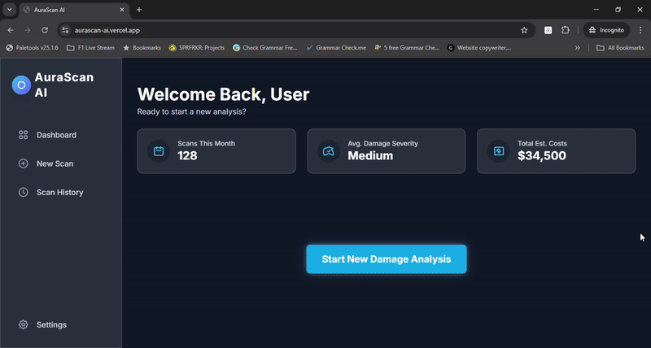

  <h1>AuraScanAI - Vehicle Damage Assessment API</h1>

  
  
  
  
  

This repository contains the complete backend service for the AuraScanAI project, a sophisticated AI-powered system for analyzing vehicle damage from images.

---

## 🚀 Live Demo & Showcase

**Live Application:** **[aurascan-ai.vercel.app](https://aurascan-ai.vercel.app/)**

### Live Demo in Action

<em>Live demo of the full analysis workflow: from image upload to the final, data-driven damage report.</em>

### Final Application Screenshot

---

## 🌐 Project Ecosystem

*   **Live Backend API:** [Hugging Face Spaces](https://huggingface.co/spaces/ehsanulhaque92/AuraScanAI)
*   **Frontend Source Code:** [MdEhsanulHaqueKanan/aurascan-frontend](https://github.com/MdEhsanulHaqueKanan/aurascan-frontend)

---

## 🤖 AI Model Details

*   **Model Architecture:** A multi-task **Vision Transformer (`vit_base_patch16_224`)** with separate heads for severity classification and bounding box regression.
*   **Training Data:** Fine-tuned on a comprehensive dataset of **over 15,500 images**.
*   **Training Performance:** Achieved a best **validation loss of 248.27** after 6 epochs of training on a Kaggle NVIDIA T4 GPU.
*   **Final Model:** The final model artifact (`best_model.pth`) is **~343 MB** and is deployed with the API.

---

## ⚙️ API Endpoints

The server provides two main endpoints: `/ping` (GET) for health checks and `/analyze` (POST) for image analysis. See source code for full details.

---

## 📜 MVP Approach & Future Roadmap

This project serves as a powerful Proof of Concept (MVP), demonstrating a complete end-to-end pipeline.

**Current Capability (MVP):** The AI model is an **Image Assessment Model**, designed to identify the single most prominent damage area in an image and provide a holistic analysis.

**Future Roadmap:** The next phase will involve evolving the AI core into a full **Multi-Object Detector** (e.g., using a DETR or YOLO architecture) to identify and provide details for multiple, distinct damages in a single image.